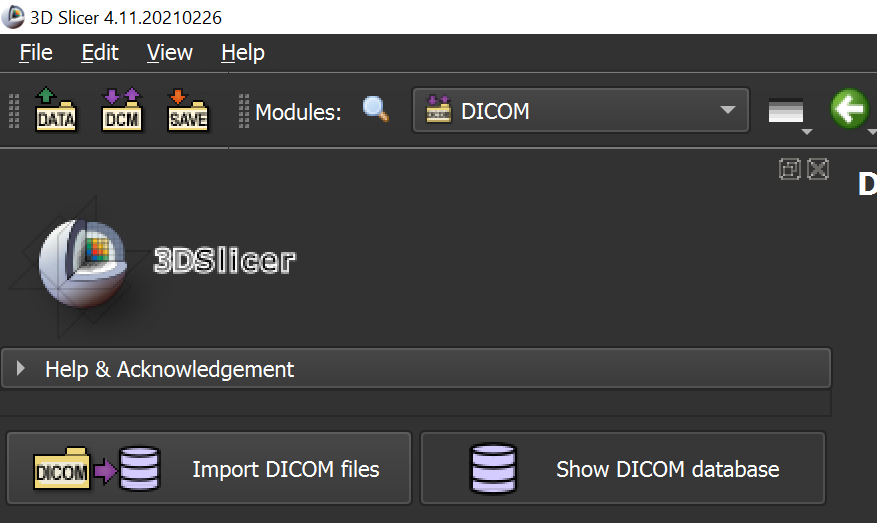
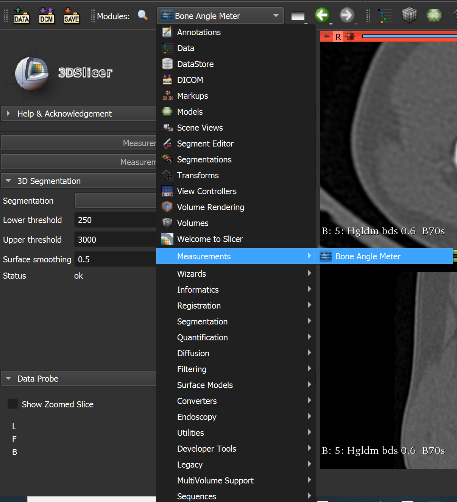
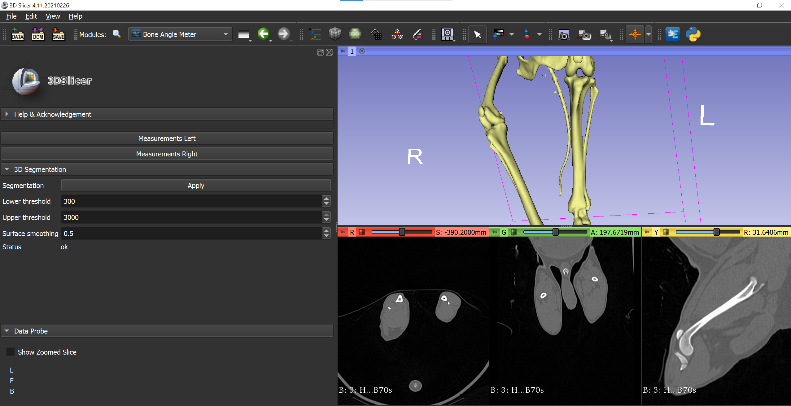
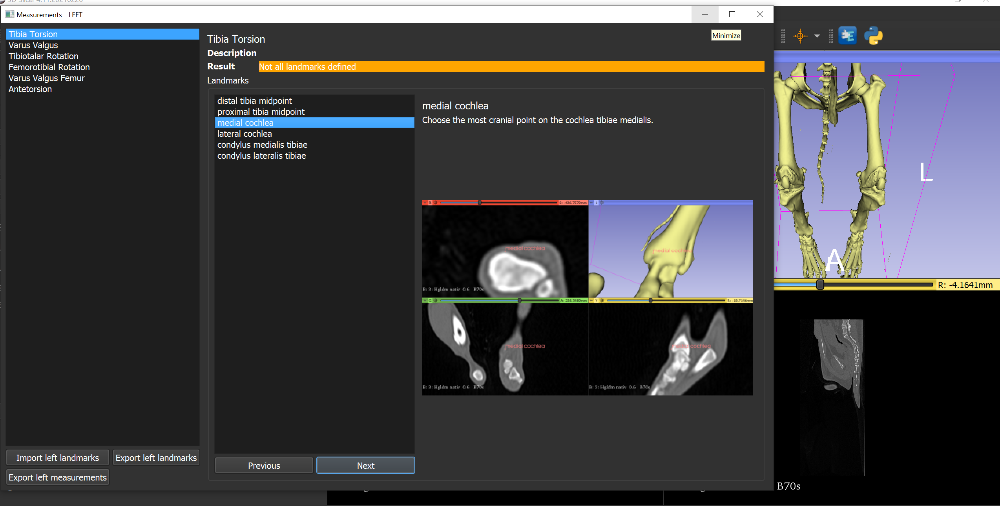

# BoneAngleMeter

This repository contains the code developed during Juliette Burg Personnaz' dissertation at *CTK, LMU Munich*. 
This 3D-Slicer plugin can be used to measure bone-angles in CT-images. The currently supported measurements are only valid for the canine hind-limbs. 

## Usage
1.	Select the "DCM" button on the upper-left and when select the button "Import Dicom files" and choose the Dicom files you want to work with

    
2.	Choose "Measurements --> Bone angle meter" on the workstation. 

    

3.	Select the button "Apply" to show the 3D bone model. The threshold can be adapted by changing the numbers of the lower and the upper threshold and reselecting "Apply" 

4.	Select the "right" or "left" button to start the measurement of the angles of the left or the right hind limb. 
5.	A pop-up window appears showing the different angles which can be measured. Choose the measure you want to start with. 

6.	Choose the first point of the measure. On the right a description and a picture shows how to set the point. If you are not satisfied with the selected point, you can change it by reselecting the point on one of the four windows showing the computertomographic images. 
7.	When you have finished setting the points, the angle value and the sens of the angle appears in green on the pop-up window. 
8.	To save the landmarks, select "export landmarks", to save the results of the angle measurements, select "export measurements" on the left of the pop-up window. 
9.	If you want to rework on the same landmarks, select "import landmarks" and choose the right CSV file. 


## Installation instructions

1. Make sure that you have installed *3D Slicer*. If not, please download it [here](https://download.slicer.org/) and install it.
2. Download the latest release of the *BoneAngleMeter* module from [here](https://github.com/jburgp/BoneAngleMeter_public/releases). Select ```.zip``` file under "Assets*.
3. Extract the ```.zip``` file to a folder of your choice, e.g. to ```Documents```. 
4. Open *3D Slicer*
5. In the drop-down menu "Modules", go to "Developer Tools --> Extension Wizard"
6. Click "Select Extension" in the left sidebar under "Extension Tools"
7. Select the folder where you unpacked the ```.zip``` file to.
8. Uncheck the "Enable developer tools" checkbox and click ok
9. You should now find the *BoneAngleMeter* module in the "Modules" drop-down menu under "Measurements --> Bone Angle Meter"
